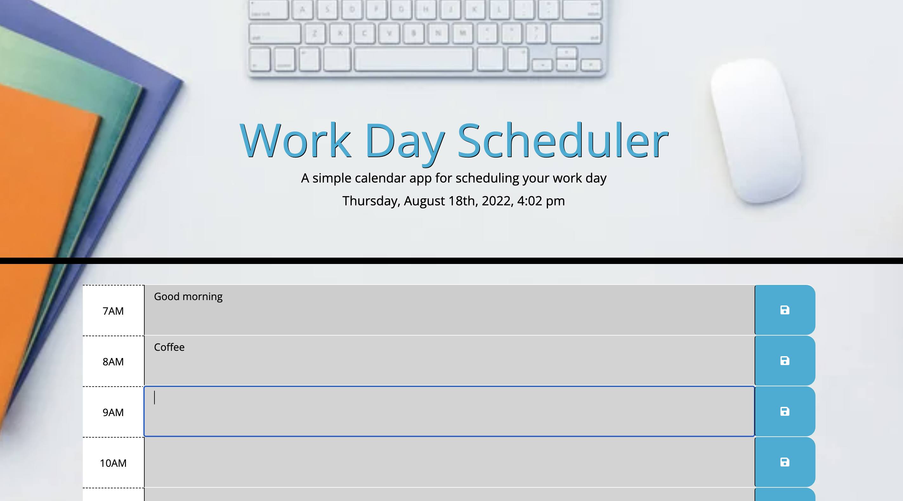
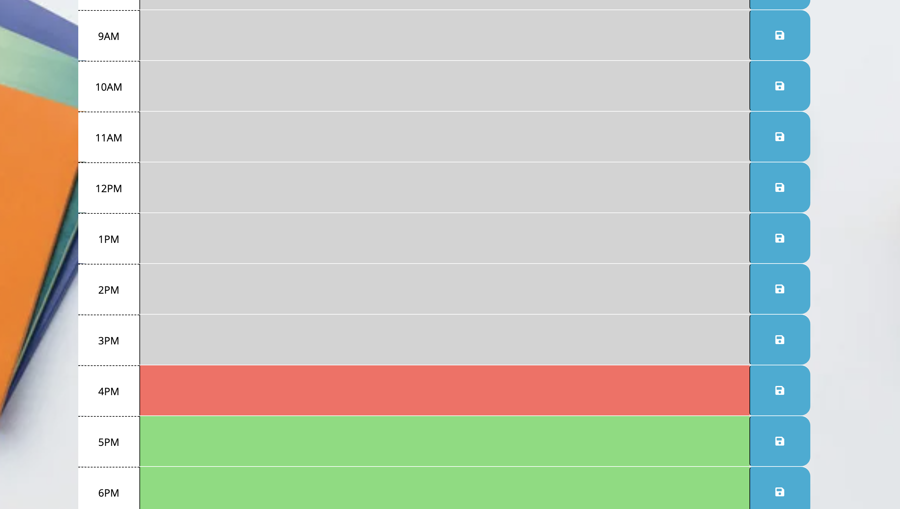

# week5
# 05 Third-Party APIs: Work Day Scheduler

## My work accord to my task

According to our task we supposed to create day planner for every hour to create a day schedule. Every hour row has own background color past/present/future comparasing to my current time. Time needs to be prented by [Moment.js](https://momentjs.com/) library. Select elements from HTML file by jQuery selector. 
``

## Criterias and application

My application needs to save my planned event per each hour to local storage and insulate it after refresh (or re-open) the page of application. I see every hour is shown in diffrent color acoording to previous statment (pas/present/future - these classes we had in provided CSS). My HTML file shows my bisness time when I will plan my day (it could be set up with inner HTML function to replace each div per hour from my HTML). When I click Save button that saves my input into local storeage and keep it in my day events "textareas" per hour.
Clear button removes the event per hour (removes it from local storage).

The simple interface:

Past hours are grey out, presenr hour is shown in red and future hours are in green.

###
* The URL of the deployed application

* The URL of the GitHub repository, with a unique name and a README describing the project
 https://maryiavinogradova.github.io/week5/
 https://github.com/MaryiaVinogradova/week5.git

####
P.S. Sorry if my description is not so elliquent - that is only because it is so hard for me to describe it in English. =)) 
